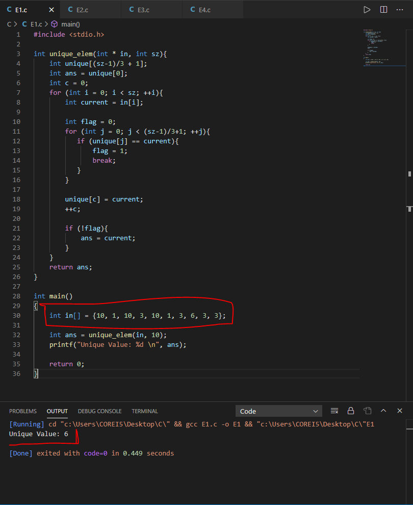
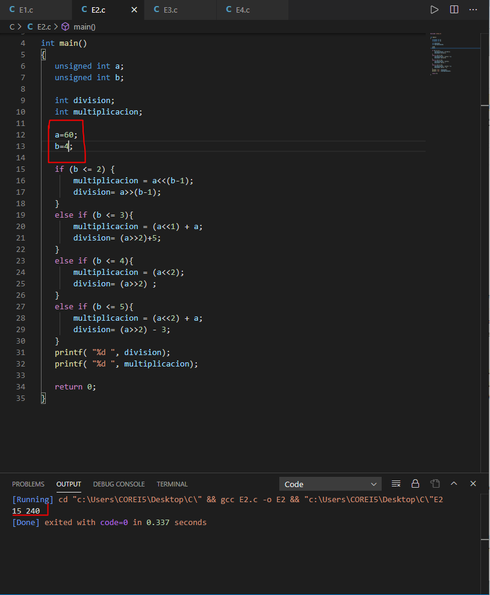
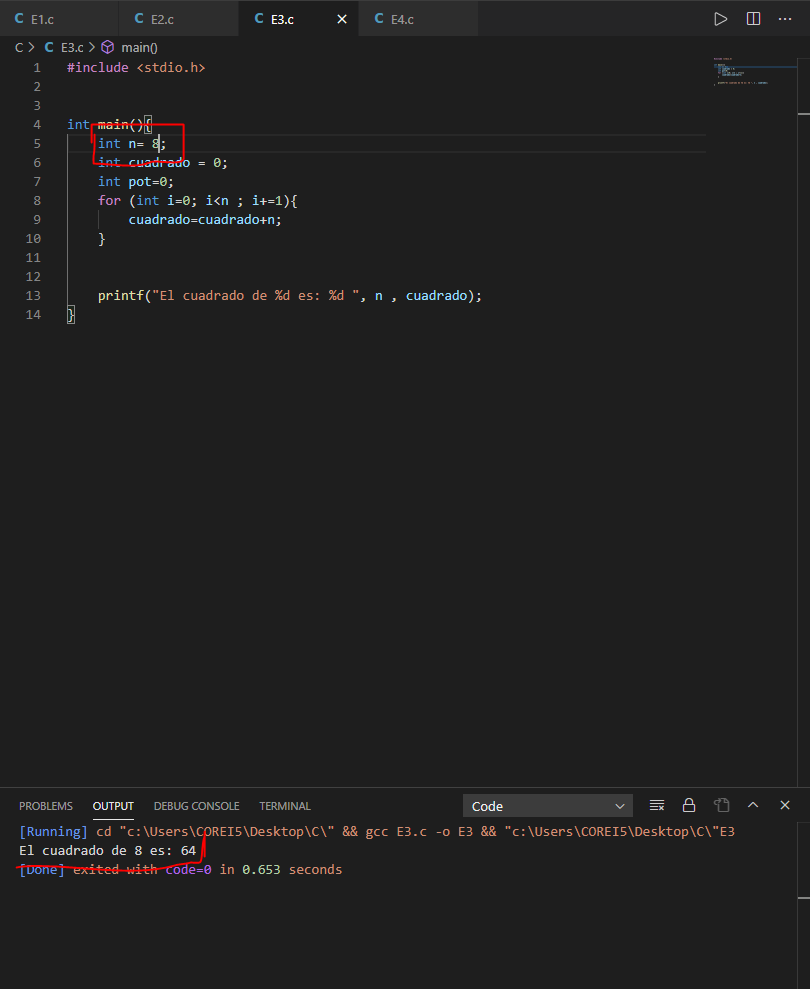
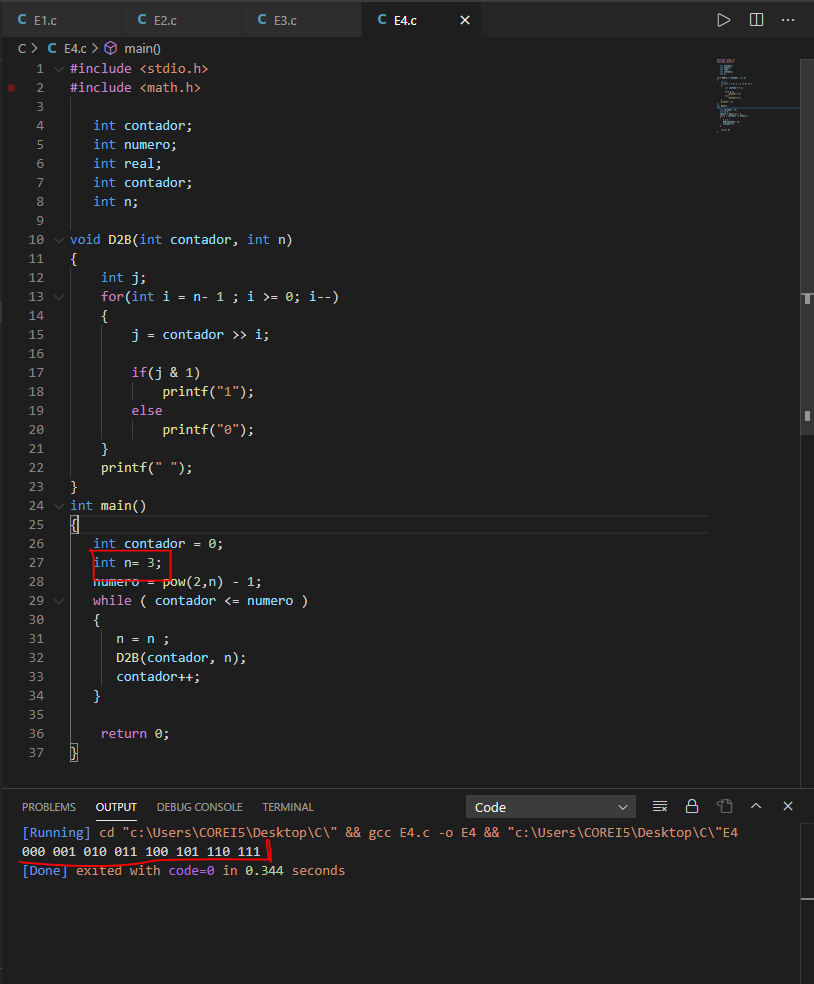

# Practica 4. Operaciones binarias en C
By: Arturo Buganza A01550821

## Objectivos

El estudiante se familiarizará con el manejo de operaciones binarias utilizando el lenguaje de programación C,
realizando una serie de problemas sencillos para su mejor comprensión.

## Instrucciones

En la siguiente práctica, se listarán distintos problemas que pueden ser resueltos con el lenguaje de programación C,
los cuales deben de ser resueltos o donde su función principal sea utilizando los operadores binarios o Bitwise, cada
uno tendrá el valor de 25% de la demostración.

### Encuentra el único elememto de un arreglo.
Dado un arreglo donde cada elemento ocurre tres veces, excepto uno que aparece una sola vez. Encuentra el elemento
único. El tiempo de complejidad es O(n) y O(1) de espacio extra. 

Examplo:
Input: arr[] = {10, 1, 10, 3, 10, 1, 1, 2, 3, 3}
Output: 2

### Multiplicaciones y divisiones
Realice un programa donde reciba 2 números enteros sin signo y permita realizar la división o la multiplicación de los
mismos, usando solamente operadores binarios.

### Calcule el cuadrado de un número sin utilizar ningún operador numérico.

Dado un entero N, calcule el cuadrado de un numero sin utilizar \*, / o librerías de potencias.

Input: n = 5
Output: 25

Input: 7
Output: 49

Input: n = 12
Output: 144

### Generador de secuencias de Grey Code

Dado un numero N, genera los patrones de bits de 0 a 2^n-1, donde cada patrón sucessivo difiere en 1 bit.

Ejemplo:
El siguiente es para una secuencia de 2-bit (n = 2)
  00 01 11 10
3-bite (n = 3)
  000 001 011 010 110 111 101 100
4-bit (n = 4)
  0000 0001 0011 0010 0110 0111 0101 0100 1100 1101 1111 
  1110 1010 1011 1001 1000

### Reporte
Para esta práctica, reporta un screeshot de la demostración de cada uno de los problemas, así como adjuntando el código
del problema principal, además de explicar la solución.

Ejercicio 1: El primer ejercicio era encontrar el valor unico de un arreglo, se utilizo una función que como se muestra en el screenshot, con ayuda de ciclos for y con una variable a manera de flag mostraba cuando un número se repetía y seguia con el siguiente, asi hasta encontrar el valor que no se repite, el cuál es impreso en la pantalla de salida.  

Ejercicio 2: El segundo es el de las multiplicaciones y divisiones de dos números usando unicamente bitwise logic, para lo cual utilicé shift operations que multiplican el valor si son hacia la izquierda, y lo dividen si se hace hacia la derecha. Esto funciona porque recorre todos los bits, aumentando o disminuyendo el valor inicial.  

Ejercicio 3: Como ejercicio número tres tuvimos que encontrar el cuadrado de un numero sin multiplicaciones ni potencias, para esto se utilizo un ciclo for y un acumulador que sumaba el numero la cantidad de veces que se pusiera como numero mismo. Fué a mi parecer el más sencillo de los 4 ejercicios.  

Ejercicio 4: Para finalizar, el ejercicio 4 nos pedía imprimir la serie de Grey para lo cual creamos una función que es referenciada en el main. La n es nuestra entrada y entre más pongamos, más itera y va imprimiendo la seríe como se muestra en la demostración.  

### File uploads
En el repositorio de la práctica de github se adjuntará el código fuente (archivos .c) de cada uno de los problemas.

Los 4 archivos del ejerecicio se encuentran en la carpeta titulada **CodeC** dentro de este mismo repositorio.

### Demonstration
Se realizará un screenshoot de cada una de la resolución de cada uno de los problemas, además se grabará un video
explicando la solución y ejecutandola para validar su comprobación.

Las capturas de pantalla se agregaron en la sección previa de **Reporte**.

Youtube: https://youtu.be/9IvF-efEm8o

## Conclusion
Para concluir creo que esta practica es un buen primer acercamiento a conocer la programación en C para los que no estamos tan acostumbrados e inmersos en el mundo de la programación. Lo más dificil para mí fue encontrar un entorno amigable en el que me adaptara y comenzar a programar, por recomendación de un amigo ingeniero en sistemas opte por visual studio code y creo que fué una gran opción. Una vez que empezamos a programar todo fue volviendose más y más intuitivo, es cosa de practicar supongo. Las operaciones bitwise me parecen muy interesantes porque son las que menos memoria de nuestro microcontrolador gastan y por tanto las que mejor deberíamos de saber utilizar, lo que es más simple para nosotros como multiplicar o dividir para nuestro procesador puede ser más laborioso.
